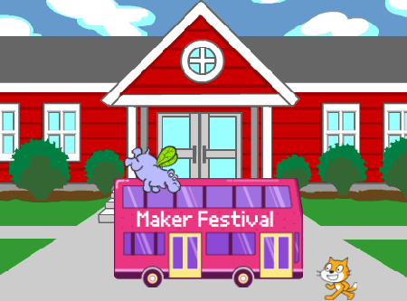

## Introduction

In this project, you will create an animation with sprites that run or fly to catch a bus. 

You will:
+ Make sprites do different things `when green flag clicked`{:class="block3events"}
+ Position sprites on the **Stage**
+ Use a `repeat`{:class="block3control"} loop to `move`{:class="block3motion"} sprites and `switch costumes`{:class="block3looks"}

--- no-print ---
--- task ---

### Try it

  

Click on the green flag to watch the animation. 

Which sprites change their costumes to create an animation effect?

  <iframe allowtransparency="true" width="485" height="402" src="https://scratch.mit.edu/projects/embed/486719199/?autostart=false" frameborder="0"></iframe>

--- /task ---
--- /no-print ---

--- print-only ---

--- /print-only ---

**Animation** creates the effect of movement by changing pictures quickly. The first animators carved pictures out of wooden blocks and used them as stamps. It is much faster to use Scratch to code your animation!

