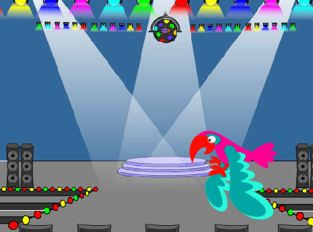

## What next?

If you are following the [Introduction to Scratch](https://projects.raspberrypi.org/en/pathways/scratch-intro) pathway, you can move on to the [Find the bug](https://projects.raspberrypi.org/en/projects/find-the-bug) project. In this project, you will make a game in which you have to find the bug that is hiding on each level.

--- print-only ---

--- /print-only ---

--- no-print ---

  <iframe allowtransparency="true" width="485" height="402" src="https://scratch.mit.edu/projects/embed/486719939/?autostart=false" frameborder="0"></iframe>

--- /no-print ---

If you want to have more fun exploring Scratch, then you could try out any of [these projects](https://projects.raspberrypi.org/en/projects?software%5B%5D=scratch&curriculum%5B%5D=%201).
