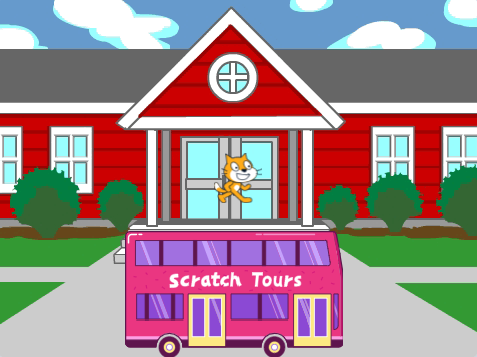
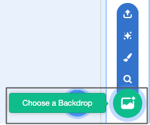
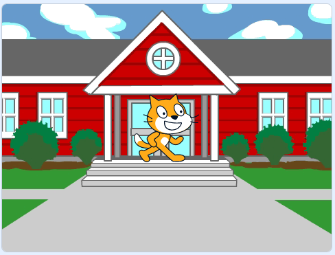
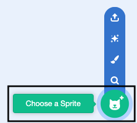
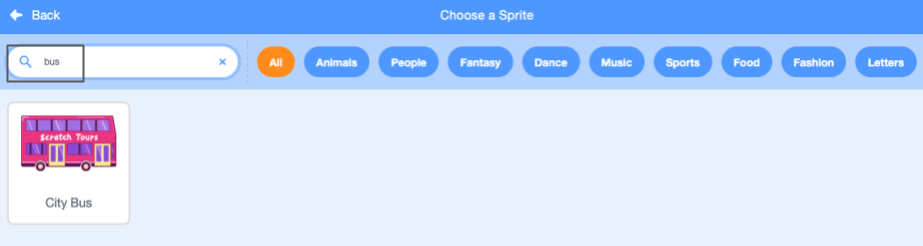
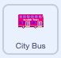
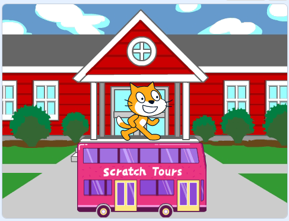
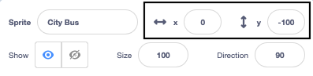
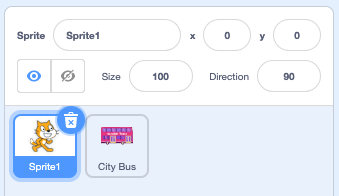
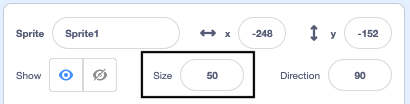

## Create your bus scene

<div style="display: flex; flex-wrap: wrap">
<div style="flex-basis: 200px; flex-grow: 1; margin-right: 15px;">
You will choose a backdrop and add a bus sprite.
</div>
<div>

{:width="300px"}

</div>
</div>

--- task ---

Open the [Catch the bus starter project](https://scratch.mit.edu/projects/582214330/editor){:target="_blank"}. Scratch will open in another browser tab.

[[[working-offline]]]

--- /task ---

--- task ---

Click (or on a tablet, tap) on **Choose a Backdrop** in the Stage pane (in the bottom right-hand corner of the screen):



--- /task ---

--- task ---

Click on the **Outdoors** category. Add a backdrop that makes a good starting point for your bus: 



--- /task ---

--- task ---

Click on **Choose a Sprite**: 



--- /task ---

--- task ---

Type `bus` in the search box at the top:



Add the **City Bus** sprite to your project.

--- /task ---

 In Scratch, you run projects by clicking on the green flag above the Stage. The bus needs to be in its starting position `when green flag clicked`{:class="block3events"}.

--- task ---

Make sure that the **City Bus** sprite is selected in the Sprite list below the Stage.

Drag a `when green flag clicked`{:class="block3events"} block from the `Events`{:class="block3events"} blocks menu to the Code area: 



```blocks3
when flag clicked
```

--- /task ---

--- task ---

Drag the bus to a good position on the Stage:



The **x** and **y** coordinates (the numbers used to describe the position) of the bus are shown in the Sprite pane below the Stage:




--- /task ---

--- task ---

Add a `go to x: y:`{:class="block3motion"} block:


```blocks3
when flag clicked
+go to x: (0) y: (-100)
```

The numbers in the `go to x: y:`{:class="block3motion"} block are the current x and y coordinates of the bus. The numbers in your project might be a bit different.

--- /task ---

--- task ---

**Test:** Drag the bus to anywhere on the Stage, and then click on the green flag. The bus should always go to its starting position.

--- /task ---

When you drag the bus, it goes in front of the Scratch Cat. 

--- task ---

To make sure that the **City Bus** sprite is always behind all the character sprites, add a `go to front layer`{:class="block3looks"} block, then click on `front`{:class="block3looks"} and change it to `back`{:class="block3looks"}:


```blocks3
when flag clicked
go to x: (0) y: (-100)
+ go to [back v] layer
```

**Tip:** If you cannot see the `go to front layer`{:class="block3looks"} block, you need to scroll down in the `Looks`{:class="block3looks"} blocks menu.

--- /task ---

--- task ---

You can change the colour of the bus:


```blocks3
when flag clicked
go to x: (0) y: (-100)
go to [back v] layer
+set [color v] effect to (50) // try numbers up to 200
```

--- /task ---

--- task ---

The Scratch Cat appears in all new Scratch projects as **Sprite1** in the Sprite list. Click on the **Sprite1** sprite in the Sprite list to get ready to animate the Scratch Cat:



**Tip:** If you have accidentally deleted the **Sprite1** (Scratch Cat) sprite, you can click on the **Choose a Sprite** icon and search for `cat`. 

--- /task ---

At the moment, the Scratch Cat is too big to fit on the bus. 

--- task ---

In the Sprite pane, click in the **Size** property and change the Scratch Cat's size to `50`:



--- /task --- 

--- save ---
