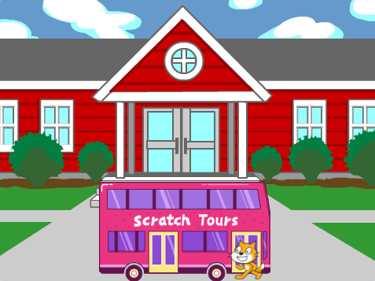
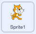
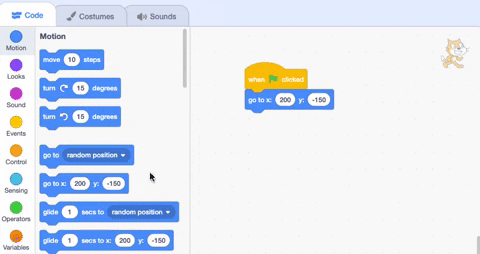

## The Scratch Cat catches the bus

<div style="display: flex; flex-wrap: wrap">
<div style="flex-basis: 200px; flex-grow: 1; margin-right: 15px;">
You will animate the Scratch Cat to appear on the **right-hand side** of the Stage and walk to the bus by repeating a small movement many times in a **loop**. 
</div>
<div>

{:width="300px"}

</div>
</div>

### Get the Scratch Cat into their starting position

--- task ---

Click in the **Direction** property in the Sprite pane. Rotate the arrow to point to `-90`. Then, click on the **Left/Right** icon in the middle to change the rotation style to `left-right` to stop the Scratch Cat turning upside down:


--- /task ---


--- task ---

Drag the Scratch Cat to the bottom right-hand side of the Stage.

**Tip:** If you try to position a sprite off the Stage, it will move back to its last position on the Stage. 

--- /task ---

--- task ---

Add code to get the Scratch Cat to their starting position:



```blocks3
when flag clicked
go to x:(200) y:(-150) // bottom right-hand side
```

--- /task ---

--- task ---

**Test:** Drag the Scratch Cat to a new position, then click on your `go to x: y:`{:class="block3motion"} block. The Scratch Cat should move back to the bottom right-hand side each time.

--- /task ---

### Animate the Scratch Cat

You will add code in a `repeat`{:class="block3control"} loop to make the Scratch Cat repeat a small number of steps many times. This will make the Scratch Cat appear animated.

--- task ---

Add a `repeat`{:class="block3control"} `10` block, then drag a `move`{:class="block3motion"} `10` `steps`{:class="block3motion"} block inside it: 




```blocks3
when flag clicked
go to x:(200) y:(-150) // bottom right-hand side
+ repeat (10) // try different numbers
move (5) steps //  5 is a good walking speed
end
```

--- /task ---

--- task ---

**Test:** Click on the green flag. Try changing the numbers so that the Scratch Cat stops at the bus.

--- /task ---

Some sprites have more than one costume. You will use the **Scratch Cat** sprite's costumes to create an animation of the Scratch Cat walking.   

--- task ---

Click on the **Costumes** tab. The **Scratch Cat** sprite has two costumes, and together, they can be used to make a walking movement. 

--- /task ---

--- task ---

Click on the **Code** tab. Add a `next costume`{:class="block3looks"} block:


```blocks3
when flag clicked
go to x:(200) y:(-150) // bottom right-hand side
repeat (20) // try different numbers
move (5) steps //  5 is a good walking speed
+ next costume 
end
```
--- /task ---

--- task ---

**Test:** Click on the green flag, and the Scratch Cat will walk to the bus. 

--- /task ---

Now, you will make the Scratch Cat seem to enter the bus. 

--- task ---

Add a block to `hide`{:class="block3looks"} the Scratch Cat when they reach the bus:


```blocks3
when flag clicked
go to x:(200) y:(-150) // bottom right-hand side
repeat (20) // try different numbers
move (5) steps //  5 is a good walking speed
next costume 
end
+ hide
```

--- /task ---

--- task ---

**Test:** Click on the green flag again, and you will see that the Scratch Cat has now disappeared.

--- /task ---

The Scratch Cat needs to reappear when you run the animation again.

--- task ---

Add a `show`{:class="block3looks"} block so that the Scratch Cat appears before they walk to the bus:


```blocks3
when flag clicked
go to x:(200) y:(-150) // bottom right-hand side
+ show
repeat (20) // try different numbers
move (5) steps //  5 is a good walking speed
next costume 
end
hide
```

**Tip:** When you use a `hide`{:class="block3looks"} block, you need to also add a `show`{:class="block3looks"} block to make sure that a sprite is visible when it needs to be.

--- /task ---

--- task ---

**Test:** Click on the green flag to test your project, and make sure that the Scratch Cat appears. 

--- /task ---

--- save ---
