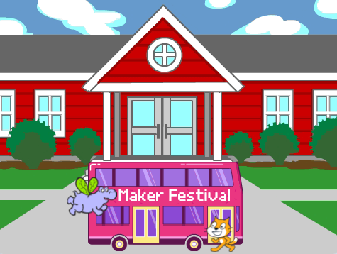
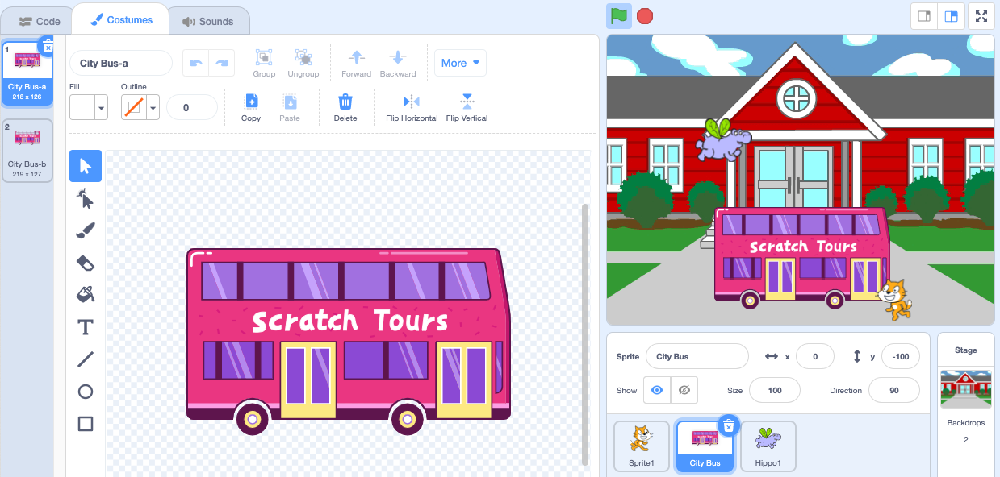
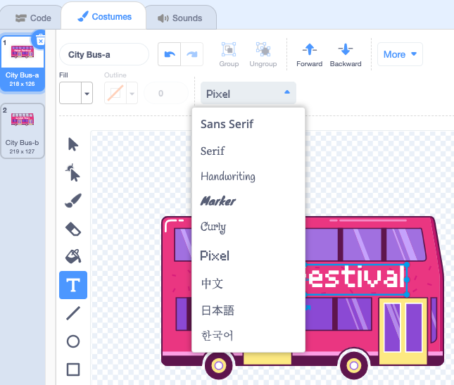
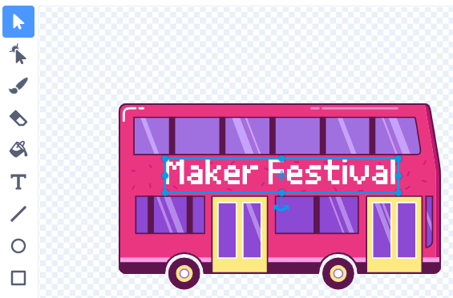

## Change the destination

The writing on the bus says "Scratch Tours", but you can change the destination to one of your choice. Where do you want your bus to go?  

{:width="300px"}

--- task ---

Select the **City Bus** sprite and click on the **Costumes** tab:

--- /task ---

--- task ---

Click on the white "Scratch Tours" text to select it, and then click on **Delete** to remove it.

--- /task ---

**Tip:** You can use the **Delete** icon in the Paint editor or the <kbd>Delete</kbd> key on your keyboard.

--- task ---

Select the **Text** (writing) tool.

Click on the bus where you want your text to start, and type the destination of your choice.

To change the font (writing style), you can click on the **Font** drop-down menu:

--- /task ---

--- task ---

Click on the **Select** (Arrow) tool, then drag the text to position it on the bus.

--- /task ---

--- save ---
