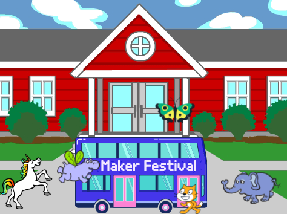

## Upgrade your project

Now, you can add a sprite of your choice to your animation. You will need to add code to make your sprite `go to`{:class="block3motion"} a starting position, `point`{:class="block3motion"} in the right direction, and then `repeat`{:class="block3control"} `move`{:class="block3motion"} and `next costume`{:class="block3looks"} blocks to reach the bus.

**Tip:** When you click on **Choose a Sprite**, you can hold your mouse cursor over a sprite to see its costumes, or on some mobile devices, you can tap and hold on a sprite to see its costumes (if a window pops up when you tap and hold on a sprite, tap at the side of the screen to close the window and see the costumes). Looking at sprites' costumes can help you find a sprite that works well for animation.

{:width="300px"}

You can use any of the blocks that you learned about in this project, as well as those that you already know:

```blocks3
when flag clicked

when [timer v] > [5]

go to x: [0] y: [0] // drag the sprite to choose x and y

show

hide

glide [2] secs to x: [0] y: [-100] // bottom middle of the Stage

repeat [30]
end

point towards (City Bus v)

point in direction (180) // point down

set rotation style [left-right v]

move [3] steps

next costume

start sound [clown honk v]

wait [0.1] seconds // short delay

set [color v] effect to [50] // up to 200
```

--- collapse ---
---
title: Completed project
---

You can view the [completed project here](https://scratch.mit.edu/projects/486719199/){:target="_blank"}.

--- /collapse ---

You can also 'remix' the project to make any changes you like. You could add sound effects to the bus or other sprites, or set the colour effect of the bus. One of the sprites could miss the bus and not hide.

Thanks to digital maker Lyla for sending this fantastic upgrade!


--- save ---
